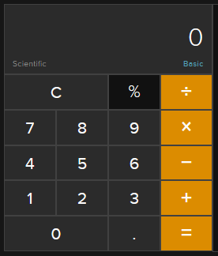

# Daily Commit Challenge - Day 2

I am challenging myself to make a commit daily. This will at the very least, get me coding daily and increasing my skills. 

Each day, I will tackle an easy/medium difficult project. I will be uploading all my code to [my GitHub profile](https://github.com/willbushie). My goal is to code daily (and hopefully make at least one commit). As long as I'm coding daily and improving my skills, then this challenge is a success.

*Please Note: These projects will sometimes have very little commits (someimtes even only one). This is for simple developemnt and I would use more commits with a higher complexity project.*

## Project Goals

Today's project is a simple webpage containing a calculator. This calculator will be very simple. It won't employ anything outside of basic addition, subtraction, multiplication and division (to keep things simple and project scope small). 

- [x] Setup a Docker container for a basic Apache webserver.
- [x] Create a classic calculator layout in the center of the webpage with HTML & CSS.
- [ ] Using JavaScript, allow the calculator to function as expected.

I used the DuckDuckGo calculator as inspiration. 


## How To Test

Utilizing Docker, testing this code is very straightforward. The project contains a `docker-compose.yml` file which contians all configuration for the container. Just run the below commands once the code is downloaded. 

Here is the command needed to start the container:
```
$ docker-compose up -d
```

To stop and remove the container once you are done, run this command:
```
$ docker-compose down
```

To get a list of running containers, use this command: 
```
$ docker ps
```

*Note: For easy identification, the container created is called: `1006-apache-container`.*

## Steps & Time To Complete

Here are the steps I took to accomplish this project. 

1. Write the README (using a template) and create the basic files needed (10 mins).
2. Create a classic calculator layout in HTML and styling with CSS (1.5 hours).
3. Add Calculator functionality with JavaScript (3:20PM - 4:10PM).

**Total project time (including coding & research): **

## What I Learned

A list of things that I learned during this project.

- How to add images to a README (.md file).
- How to place an image in a `<button>`.
- Styling can take a very long time if you don't have a lot of previous experience. CSS is dense.
- 

## Contact

If you'd like to contact me, you can reach me at my email [here](mailto:willbushie@gmail.com).